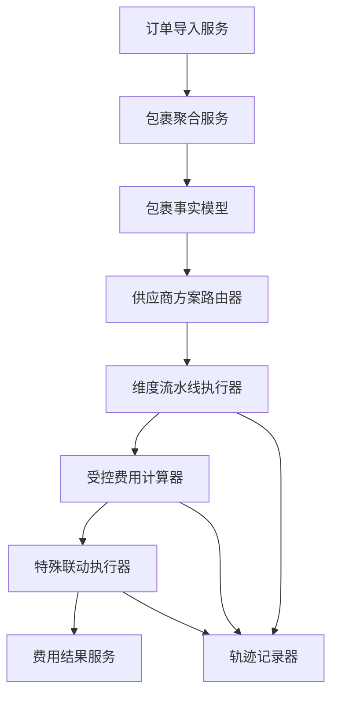
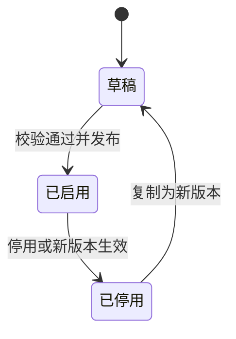

# 运费规则引擎产品方案

版本号：V2.0

| 版本 | 时间 | 修订人 | 说明 |
|---|---|---|---|
| V1.0 | 2026-08 | 产品方案初稿 | 按供应商维护固定费用和地区价格 |
| V2.0 | 2026-09-01 | Codex | 调整为分层决策流水线，不再以完整场景枚举为主 |

## 一、概述

### 1.1 背景

当前运费资料来自聚水潭订单明细和人工维护的 Excel。表格可以表达固定运费、代发费、辅料费以及部分地区价格，但存在三个问题：

- 聚水潭导出数据以商品明细为行，同一个快递单号可能对应多条 SKU 记录，不能按明细行重复计费。
- 供应商计费维度并不统一，后续会出现地区、快递、品牌、材质、件数、重量等条件。
- 旧表备注尚未完成业务确认，不能直接作为正式计费依据。

第一版方案采用“每个完整场景维护一条规则”的方式，随着维度增加会形成大量组合。V2.0 改为分层决策流水线：每个阶段只鉴定一个维度，输出标准标签或指标，计费层读取全部中间结果后计算费用。

### 1.2 产品目标

建立一套后台可维护、计算结果稳定、过程可追溯的包裹费用系统：

- 以“快递公司编码 + 快递单号”作为包裹唯一键，避免 SKU 拆行导致重复计费。
- 运费、代发费、辅料费分别计算、分别落库；金额 `0` 是有效结果，含义为免费。
- 每个业务维度独立维护，新增地区、快递或材质时不要求枚举全部组合。
- 第一阶段快速支持无额外备注、规则相对固定的供应商。
- 备注规则确认后，通过新增维度、计费方式或特殊联动逐步接入。

### 1.3 目标用户和权限

不在本模块内定义细分角色。系统复用现有权限管理，只提供可配置的功能权限点：

| 权限点 | 说明 |
|---|---|
| `freight.scheme.view` | 查看供应商方案及版本 |
| `freight.scheme.create` | 新增、复制供应商方案 |
| `freight.scheme.update` | 编辑、启停供应商方案 |
| `freight.scheme.delete` | 删除未被结算引用的草稿方案 |
| `freight.dimension.manage` | 增删改查维度鉴定配置 |
| `freight.calculator.manage` | 增删改查计费方案 |
| `freight.exception.manage` | 增删改查特殊联动规则 |
| `freight.import` | 导入 Excel 配置 |
| `freight.simulate` | 执行费用试算并查看轨迹 |

角色与权限点的绑定由已有权限系统完成。

### 1.4 名词说明

| 名词 | 说明 |
|---|---|
| 原始明细 | 聚水潭导出的单条商品记录 |
| 包裹 | 相同快递公司、相同快递单号下的所有商品明细集合 |
| 维度鉴定 | 对地区、快递、品牌、材质等单一维度执行 if / else，输出标准标签或指标 |
| 中间上下文 | 包裹经过各阶段后形成的标签、集合和数值指标 |
| 计费方案 | 读取中间上下文并计算运费、代发费或辅料费的公式 |
| 特殊联动 | 无法拆成独立维度的组合价格，例如“偏远地区 + 顺丰一口价” |
| 计算轨迹 | 本次计算经过的阶段、输入、输出、公式及最终金额 |

## 二、产品方案

### 2.1 核心设计

系统采用固定阶段、可配置分支的决策流水线：


每个鉴定阶段内部可以包含多条有序 if / else 分支，但该阶段只负责一个维度。例如地区阶段只把新疆、西藏归为“偏远地区”，不负责判断快递公司，也不直接写出最终运费。

一个包裹处理完成后可形成以下中间上下文：

```text
supplier_id = SUP-0012
region_group = REMOTE
carrier_group = SF
brand_tags = [DEFAULT]
material_quantity = { CASHMERE: 2, COTTON: 1 }
total_quantity = 3
total_weight_kg = 1.8
```

计费方案读取这些结果。例如：

```text
运费 = 偏远地区基础价 15 元 + 顺丰附加价 3 元
代发费 = 每包 1.25 元 + 超过 2 件的数量 × 0.5 元
辅料费 = 羊绒商品件数 × 1 元
```

如果供应商明确约定“偏远地区使用顺丰时固定 25 元”，该条件不能拆成独立加项，放入特殊联动阶段，将运费调整为 25 元。普通维度不需要为此枚举“地区 × 快递 × 材质 × 品牌”的全部组合。

### 2.2 与完整场景规则的区别

| 对比项 | 完整场景规则 | 分层决策流水线 |
|---|---|---|
| 配置单位 | 一条规则描述一个完整场景 | 一个配置只处理一个维度或一种计算方式 |
| 新增地区 | 可能需要补齐多个组合 | 只修改地区鉴定或地区价格参数 |
| 新增材质 | 可能复制多条规则 | 增加材质分支和对应计费公式 |
| 规则命中 | 查找完整条件组合 | 各阶段依次输出中间结果 |
| 复杂组合价 | 配置为普通规则 | 只在特殊联动中单独维护 |
| 可解释性 | 展示命中的规则 | 展示每一阶段的输入和输出 |

### 2.3 包裹聚合

计算前必须先完成聚合，不能直接对 Excel 明细行计费。

包裹唯一键：

```text
package_key = carrier_code + tracking_no
```

聚合规则：

1. 相同平台订单号、相同快递单号、多条 SKU 明细：合并成一个包裹。
2. 相同平台订单号、不同快递单号：拆成多个包裹，分别计费。
3. 不同平台订单号、相同快递单号：按实际业务合并为一个包裹，同时保留多个订单关联关系。
4. 快递单号为空：不进入正式计算，进入“待补充物流信息”队列。
5. 快递单号重复但快递公司不同：按不同包裹处理，并记录数据异常提示。

聚合后至少形成以下指标：

- 包裹总件数
- SKU 数量
- 包裹总重量
- 品牌集合
- 材质集合
- 每个品牌的商品件数
- 每种材质的商品件数
- 关联的平台订单号集合

### 2.4 供应商路由

供应商路由根据供应商编码和业务日期选择唯一生效版本：

1. 查询状态为“已启用”的供应商方案。
2. 业务日期必须处于方案生效区间。
3. 同一供应商、同一时点只能有一个生效版本。
4. 找不到方案时不自动猜测价格，结果进入“未匹配方案”异常队列。

供应商方案本身不保存所有业务组合，只负责绑定：

- 适用的维度鉴定器
- 适用的计费方案
- 特殊联动规则
- 默认兜底费用
- 生效版本

### 2.5 维度鉴定

#### 2.5.1 固定执行顺序

建议顺序如下：

| 顺序 | 阶段 | 输入 | 输出 |
|---:|---|---|---|
| 1 | 地区鉴定 | 省、市、区 | 地区标签 |
| 2 | 快递鉴定 | 快递公司编码 | 快递标签 |
| 3 | 品牌鉴定 | 包裹商品明细 | 品牌标签集合、命中件数 |
| 4 | 材质鉴定 | 包裹商品明细 | 材质标签集合、各材质件数 |
| 5 | 包裹指标 | 包裹及明细 | 总件数、总重量、SKU 数 |

供应商和生效时间在流水线开始前用于选择方案，不作为普通价格维度反复筛选。计费方式属于计算阶段，也不作为维度筛选条件。

#### 2.5.2 阶段内判断规则

每个维度由若干有序分支组成：

```text
IF province IN [新疆, 西藏] THEN region_group = REMOTE
ELSE IF province IN [上海, 江苏, 浙江] THEN region_group = CORE
ELSE region_group = NORMAL
```

阶段要求：

- 每个阶段必须有默认分支。
- 同一条输入只返回一个主分类；品牌、材质等集合型维度可以同时返回多个标签。
- 集合型维度必须明确匹配口径：任一商品、全部商品、命中商品件数或分组件数。
- 阶段输出使用标准编码，显示名称只用于后台展示。
- 调整分支顺序或内容后生成新版本，历史计算继续引用旧版本。

### 2.6 计费方案

计费方案不再负责筛选完整场景，只读取已完成的中间上下文。第一阶段支持以下计算器：

| 计算器 | 适用场景 | 示例 |
|---|---|---|
| 固定每包 | 无额外备注的固定规则 | 运费 3 元/包 |
| 分类取价 | 不同地区或快递对应不同基础价 | 偏远地区 15 元 |
| 固定价 + 按件 | 固定代发费加超件费 | 1.25 + 超出件数 × 0.5 |
| 按总件数 | 包裹商品统一按件计费 | 总件数 × 0.8 |
| 按命中件数 | 只对指定品牌或材质计费 | 羊绒件数 × 1 元 |
| 首重续重 | 按包裹重量计费 | 首重 5 元，续重 2 元/kg |
| 阶梯计费 | 件数或重量落入不同区间 | 1-3 件 5 元，4-6 件 8 元 |
| 固定为 0 | 免费 | 代发费 0 元 |

每个计算器必须指定写入字段：

- `freight_amount`：运费
- `handling_fee_amount`：代发费
- `material_fee_amount`：辅料费

三个字段独立计算和统计。任何字段都必须返回数值；没有费用时返回 `0`，不能返回空值。

### 2.7 特殊联动规则

特殊联动只解决无法拆分的跨维度价格，不作为常规配置入口。

规则结构：

| 项目 | 示例 |
|---|---|
| 适用供应商 | 花厘子服饰 |
| IF 条件 | 地区=偏远地区 且 快递=顺丰 |
| THEN 动作 | 运费直接取 25 元 |
| 影响字段 | 运费 |
| 是否命中后停止 | 是 |
| 生效时间 | 2026-09-01 起 |

同一个费用字段存在多条特殊联动规则时，在特殊规则阶段内按明确顺序执行 if / else，命中“停止”规则后不再继续。这里的顺序只处理少量业务例外，不承担常规维度组合。

### 2.8 费用输出和计算轨迹

一次正式计算生成一条包裹费用结果：

| 字段 | 说明 |
|---|---|
| `freight_amount` | 最终运费，0 表示免运费 |
| `handling_fee_amount` | 最终代发费，0 表示免代发费 |
| `material_fee_amount` | 最终辅料费，0 表示免辅料费 |
| `total_amount` | 三项合计，仅用于展示和核对 |
| `scheme_version_id` | 本次使用的供应商方案版本 |
| `calculation_status` | 成功、未匹配、数据异常、计算失败 |
| `trace_id` | 计算轨迹 ID |

计算轨迹至少记录：

- 原始包裹事实快照
- 每个鉴定阶段的输入和输出
- 使用的计费公式及参数
- 命中的特殊联动
- 三项费用的计算明细
- 执行时间和引擎版本

## 三、后台产品设计

### 3.1 信息架构

Admin 左侧保留一级菜单“运费规则”，页面内分为五个页签：

| 页签 | 用途 |
|---|---|
| 方案管理 | 管理供应商方案、版本、状态和默认费用 |
| 维度鉴定 | 管理地区、快递、品牌、材质及包裹指标的判断逻辑 |
| 计费方案 | 管理固定价、按件、按重量和阶梯公式 |
| 特殊规则 | 管理少量跨维度联动价格 |
| 费用试算 | 输入一个包裹并查看逐层执行轨迹 |

### 3.2 方案管理

列表字段：供应商、维度数、计算器数、特殊规则数、默认三项费用、版本、生效时间、状态和更新时间。

支持操作：

- 新增、查看、编辑、复制新版本、启用、停用、删除
- 按供应商和状态筛选
- Excel 导入生成草稿
- 查看方案结构和历史版本

约束：

- 已被正式计算引用的版本不能物理删除，只能停用。
- 启用新版本前必须完成规则校验和试算。
- 同一供应商的生效区间不能重叠。

### 3.3 维度鉴定

每个维度卡片展示输入字段、if / else 鉴定逻辑和阶段输出。支持新增、编辑、启停和删除。

地区、快递等单值维度使用“首次命中即结束”；品牌、材质等集合维度支持以下匹配模式：

- `ANY`：包裹中任一商品满足条件
- `ALL`：包裹中所有商品满足条件
- `COUNT_MATCHED`：返回命中商品件数
- `GROUP_COUNT`：按标签分组返回件数映射

### 3.4 计费方案

配置项包括：适用供应商、计费方式、输入指标、公式参数、写入费用字段、生效时间和状态。

公式不允许直接执行用户输入的任意脚本。后台提供受控计算模板和参数输入，服务端将配置转换为安全表达式执行。

### 3.5 特殊规则

特殊规则使用 IF / THEN 形式配置：

- IF 支持读取已经生成的维度标签和指标。
- THEN 只允许设置、增加、封顶或保底一个明确费用字段。
- 支持拖动调整阶段内执行顺序。
- 保存时检查条件完全重复、永远无法命中以及缺少停止策略等问题。

### 3.6 费用试算

试算输入包括供应商、业务日期、收货地区、快递公司、品牌、材质、件数、重量和快递单号。

结果区展示：

1. 供应商方案和版本。
2. 各维度的输入与输出。
3. 计费公式和参数。
4. 特殊联动是否命中。
5. 运费、代发费、辅料费和参考合计。

试算不写入正式结算数据，但需要记录操作日志，便于排查规则调整过程。

## 四、技术方案方向

### 4.1 核心组件



运行时不需要 AI。正式计费必须由确定性代码完成，相同输入、相同规则版本必须得到相同结果。

AI 后续只作为辅助能力：

- 从供应商备注中提取候选维度和公式草稿
- 发现规则冲突或覆盖缺口
- 生成试算案例
- 分析未匹配和费用异常

AI 生成的内容必须人工确认后才能发布。

### 4.2 核心数据表

| 表 | 用途 | 关键字段 |
|---|---|---|
| `order_import_line` | 保存聚水潭原始商品明细 | source_row_id、order_no、tracking_no、sku、quantity、weight、brand、material |
| `shipment_package` | 保存聚合后的包裹 | package_id、carrier_code、tracking_no、supplier_id、business_date |
| `shipment_package_line` | 建立包裹与商品明细关系 | package_id、source_row_id |
| `freight_scheme_version` | 供应商方案版本 | scheme_id、supplier_id、version、effective_time、status |
| `dimension_stage` | 维度定义及执行顺序 | stage_id、stage_code、order_no、match_mode |
| `dimension_branch` | 阶段内 if / else 分支 | branch_id、stage_id、condition_json、output_json、order_no |
| `calculator_plan` | 计费方式和公式参数 | calculator_id、fee_field、template_type、parameter_json |
| `special_link_rule` | 特殊联动 | rule_id、condition_json、action_json、order_no、stop_after_hit |
| `freight_calculation` | 包裹最终费用 | package_id、three_amounts、scheme_version_id、status |
| `freight_calculation_trace` | 计算轨迹 | trace_id、facts_snapshot、stage_results、formula_details |

规则条件和动作建议使用受控 JSON 结构保存，不把自然语言备注直接作为可执行规则。

### 4.3 版本和发布

方案状态：



发布校验包括：

- 是否存在默认供应商方案和必要兜底值
- 每个维度是否有 else 分支
- 公式引用的指标是否由前置阶段输出
- 三个费用字段是否都能得到数值
- 同一供应商的版本生效区间是否重叠
- 特殊联动是否存在重复条件
- 标准试算案例是否全部通过

### 4.4 性能和稳定性

| 指标 | 建议值 |
|---|---|
| 单包裹同步试算 | P95 小于 300ms |
| 批量计算 | 支持分批异步处理，每批 500-1000 个包裹 |
| 幂等 | 相同包裹、业务日期、方案版本只生成一条有效结果 |
| 可追溯 | 正式计算结果和规则版本长期保留，不随配置更新被覆盖 |
| 失败处理 | 单包裹失败不阻断整批任务，进入异常队列重试 |

## 五、版本规划

| 版本 | 范围 | 说明 |
|---|---|---|
| V1.0 快速版 | 包裹聚合、供应商路由、地区分类、固定三项费用、地区取价、版本、试算和轨迹 | 先覆盖无额外备注且规则固定的供应商 |
| V1.1 扩展版 | 快递、品牌、材质、件数、重量维度；按件、首重续重、阶梯计算器 | 备注完成业务确认后分批接入 |
| V1.2 特殊版 | 特殊联动、冲突检查、批量测试案例 | 处理少量无法拆分的组合价格 |
| V2.0 辅助版 | AI 备注提取、规则草稿、异常分析 | AI 不进入正式计费执行链 |

## 六、异常与边界

| 场景 | 处理方式 |
|---|---|
| 快递单号为空 | 不计算，进入待补物流信息队列 |
| 供应商方案不存在 | 返回未匹配，不使用其他供应商价格 |
| 业务日期无有效版本 | 返回版本缺失异常 |
| 商品材质为空 | 输出 `UNKNOWN` 标签；依赖材质的公式不得执行 |
| 包裹包含多个材质 | 输出材质集合及分组件数，由计算器选择所需指标 |
| 包裹重量为空 | 固定价和按件规则可继续；按重量规则返回数据不足 |
| 费用结果为 0 | 保存 0，并在界面显示“免费” |
| 公式计算为负数 | 视为配置错误，阻止发布或本次计算失败 |
| 同时命中多个特殊联动 | 按该费用字段的 if / else 顺序执行；命中停止规则后结束 |
| 规则计算中途失败 | 不产生部分正式结果，三项费用统一标记计算失败 |

## 七、验收标准

| 编号 | 验收条件 | 优先级 |
|---|---|---|
| AC-01 | 同一快递单号的两条 SKU 明细只生成一个包裹费用结果 | P0 |
| AC-02 | 同一订单号的两个快递单号生成两个独立包裹费用结果 | P0 |
| AC-03 | 地区、快递、材质等阶段能够分别输出可查看的中间结果 | P0 |
| AC-04 | 运费、代发费、辅料费分别返回并落库，0 显示为免费 | P0 |
| AC-05 | 固定供应商方案无需配置完整场景组合即可完成计算 | P0 |
| AC-06 | 羊绒 2 件时，按命中材质件数计算，不误用包裹 SKU 数 | P0 |
| AC-07 | 特殊联动命中后只调整指定费用字段 | P0 |
| AC-08 | 同一输入和同一方案版本重复试算结果一致 | P0 |
| AC-09 | 试算页完整展示供应商路由、维度输出、公式和特殊联动轨迹 | P1 |
| AC-10 | 已被正式计算引用的版本不能被物理删除 | P1 |
| AC-11 | 未经确认的备注规则不能直接启用 | P1 |
| AC-12 | 页面提供方案、维度、计算器和特殊规则的增删改查及启停入口 | P1 |

## 八、待确认项

### 开发前需要确认

1. 聚水潭导出数据中的快递公司编码和快递单号字段是否始终可用，空值比例是多少。
2. 不同平台订单共用一个快递单号时，财务是否确认按一个包裹计费。
3. 包裹重量取聚水潭实重、预估重量还是供应商回传重量。
4. 特殊联动在同一费用字段内是否统一采用“首次命中后停止”。
5. 正式费用结果是否需要审批后进入财务统计。

### 备注整理后确认

1. 多材质包裹的计费口径：分别累加、取最高材质价，还是按指定材质优先。
2. 多品牌包裹的计费口径以及品牌识别字段来源。
3. 件数口径使用商品数量、SKU 行数还是指定商品命中数量。
4. 首重续重的重量进位方式和小数精度。
5. 备注中的生效日期、停用日期和历史价格是否需要回算。
